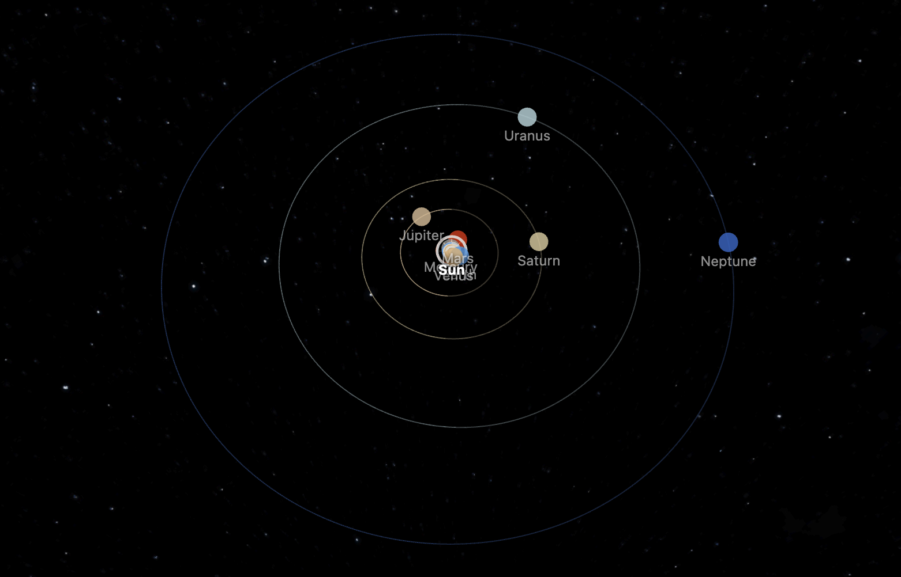
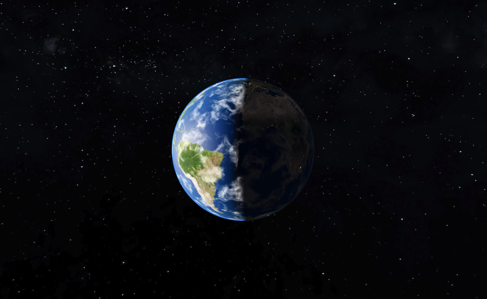
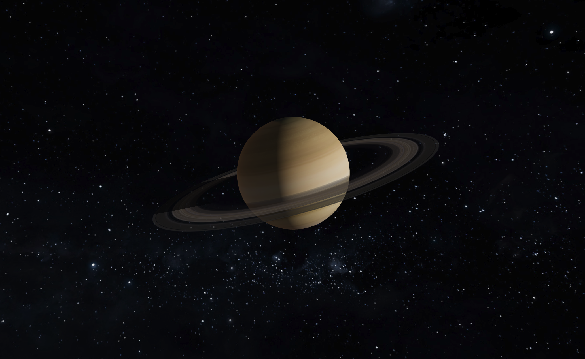

# Space Explorer

A real-scale, physically-accurate solar system explorer, built with React Three Fiber / Three.js / TypeScript / Vite.

Sizes, distances, orbital periods, orbital shapes, and axial orientation are true-to-scale and real — not artistically exaggerated. Every planet (plus Earth's Moon) is simulated as an independent [two-body](https://en.wikipedia.org/wiki/Two-body_problem) [Keplerian ellipse](https://en.wikipedia.org/wiki/Kepler_orbit) around the Sun, using real [orbital elements](https://en.wikipedia.org/wiki/Orbital_elements) referenced to the [J2000.0 epoch](https://en.wikipedia.org/wiki/Epoch_(astronomy)#Julian_years_and_J2000). The app opens with every body at its actual current position in the sky.

<!-- TODO: screenshot — wide shot of the solar system with orbit lines -->


## Features

- **True scale** — 1 scene unit = 1,000,000 km. Planet sizes, orbital distances, [eccentricities](https://en.wikipedia.org/wiki/Orbital_eccentricity), [inclinations](https://en.wikipedia.org/wiki/Orbital_inclination), and [axial tilts](https://en.wikipedia.org/wiki/Axial_tilt) all use real astronomical data.
- **Accurate orbital mechanics** — independent Keplerian two-body orbits (not [N-body gravity](https://en.wikipedia.org/wiki/N-body_problem)), solved via [Newton-Raphson](https://en.wikipedia.org/wiki/Newton%27s_method) [eccentric anomaly](https://en.wikipedia.org/wiki/Eccentric_anomaly), with real inclination, [ascending node](https://en.wikipedia.org/wiki/Longitude_of_the_ascending_node), and [argument of periapsis](https://en.wikipedia.org/wiki/Argument_of_periapsis) per planet.
- **Real planetary orientation** — each planet's pole is oriented from its real [right ascension/declination](https://en.wikipedia.org/wiki/Right_ascension) ([IAU/IAG rotational elements](https://en.wikipedia.org/wiki/Astronomical_coordinate_systems)), not a single fixed-axis tilt.
- **Day/night terminator shading**, atmosphere glow, sunset tinting, and Saturn's [ring](https://en.wikipedia.org/wiki/Rings_of_Saturn) shadow (an analytic ray-sphere shadow, correct on both ring faces).
- **Procedural, continuously-animated clouds** — [domain-warped](https://en.wikipedia.org/wiki/Domain_warping) [fractal noise](https://en.wikipedia.org/wiki/Fractional_Brownian_motion) sampled by surface normal (no UV seams), since real cloud cover has no closed-form position over time.
- **Adjustable simulation speed**, from real-time up to fast-forward.
- **Camera controls** — click any body to smoothly focus and dolly to it, with per-body view distances scaled to its real radius.

<!-- TODO: screenshot — close-up of a planet with visible atmosphere/clouds -->


<!-- TODO: screenshot — Saturn showing ring shadow -->


## Getting started

```bash
npm install
npm run dev
```

Then open the printed local URL in your browser.

## Scripts

| Command | Description |
| --- | --- |
| `npm run dev` | Start the Vite dev server |
| `npm run build` | Type-check (`tsc -b`) then production build (`vite build`) |
| `npm run lint` | Run ESLint over the whole project |
| `npm run preview` | Serve the production build locally |

There is no automated test suite. Verification is `tsc -b --noEmit` + `npm run lint` passing, manual checks in the running dev server, and — for anything touching orbital mechanics — cross-checking against real [ephemeris](https://en.wikipedia.org/wiki/Ephemeris) data from the [JPL Horizons API](https://ssd.jpl.nasa.gov/api/horizons.api).

## Tech stack

- [React Three Fiber](https://docs.pmnd.rs/react-three-fiber) / [drei](https://github.com/pmndrs/drei) / [Three.js](https://threejs.org/) for 3D rendering
- React 19 + TypeScript
- Vite for dev/build tooling

## Project structure

Rendering is split by entity, each with its own top-level file and (where needed) a same-named sibling folder for private sub-components:

- `src/astronomy.ts` — real orbital/physical data per planet (`PLANETS`), referenced to the J2000.0 epoch.
- `src/simulation.ts` — the simulation clock (time + playback speed).
- `src/Planet.tsx` (+ `src/Planet/`) — the Kepler solver, orbital/pole transforms, and planet rendering (mesh, orbit line, label, optional ring/atmosphere/clouds).
- `src/Moon.tsx` (+ `src/Moon/`) — Earth's Moon.
- `src/Sun.tsx` (+ `src/Sun/`) — the Sun and its glare/diffraction-spike effect.
- `src/Scene.tsx` — the composition root that assembles all bodies.
- `src/CameraRig.tsx` — camera controls, focus/dolly behavior, adaptive near plane.
- `src/StatsPanel.tsx`, `src/SpeedControl.tsx`, `src/ViewControls.tsx` — UI overlays outside the 3D canvas.

See [CLAUDE.md](CLAUDE.md) for a deeper dive into the architecture and the reasoning behind specific implementation choices (frame ordering, orbital mechanics conventions, LOD rendering, etc.).

## Known limitations

Not every body is depicted with full accuracy yet:

- **Venus's sub-solar longitude** has a real, currently-unexplained periodic drift against this app's model (~3°/day, repeating every Venus year) — see [issue #2](https://github.com/gstsdev/space-explorer/issues/2) for what's already been ruled out.
- **Uranus's sub-solar longitude** has a residual calibration offset (~6-8°) not yet resolved to the same precision as the other planets.
- **Moons** are incomplete — only Earth's Moon is currently simulated; other planets' moons aren't depicted yet.

Other open bugs and limitations are tracked as GitHub issues on this repo rather than in-code TODOs.

## Credits

Planet/moon textures are from [Solar System Scope](https://www.solarsystemscope.com/textures).

## License

[MIT](LICENSE)
